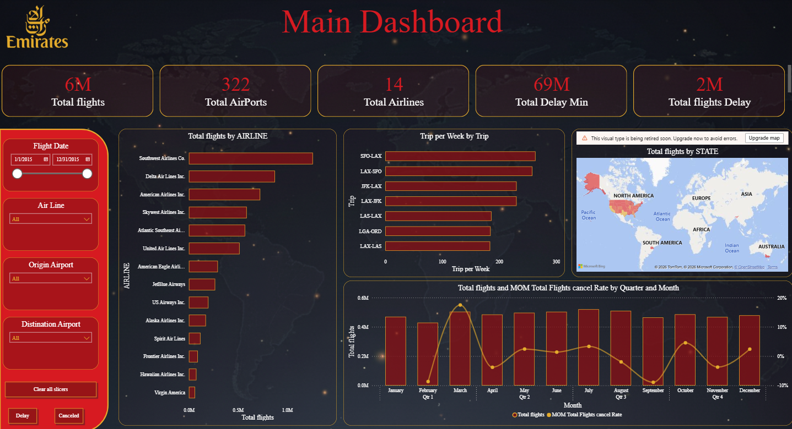

# Airline Operations Analytics - Power BI

## Project Overview

This project analyzes airline operations data using Power BI, with a focus on flight activity, delays, cancellations, airline performance, and route performance.

I built the dashboard to provide a clear view of overall flight operations and to make it easier to identify delay patterns, cancellation trends, and differences in performance across airlines, airports, routes, and time periods.

The report is divided into three main pages: Main Dashboard, Delay Dashboard, and Cancellation Dashboard.

---

## Main Dashboard

The Main Dashboard provides an overall view of airline operations and flight activity.

Key metrics include:

- Total Flights
- Total Airports
- Total Airlines
- Total Delay Minutes
- Total Delayed Flights
- Flights by Airline
- Trips by Route
- Flights by State
- Monthly Flight Trends

---

## Delay Analysis

The Delay Dashboard focuses on delayed flights and helps identify where and when delays occur.

The analysis includes:

- Total Delayed Flights
- Total Delay Minutes
- Delayed Flights by Airline
- Delay Performance by Route
- Delay Categories
- Monthly Delay Trends
- Month-over-Month Delay Rate
- Filtering by Flight Date, Airline, Origin Airport, and Destination Airport

---

## Cancellation Analysis

The Cancellation Dashboard focuses on flight cancellations and the main reasons behind them.

The analysis includes:

- Total Cancelled Flights
- Cancelled Flights by Airline
- Cancellations by Route
- Cancellation Reasons
- Monthly Cancellation Trends
- Month-over-Month Cancellation Rate
- Filtering by Flight Date, Airline, Origin Airport, and Destination Airport

---

## Dashboard Features

The report includes interactive filters that allow users to explore the data by:

- Flight Date
- Airline
- Origin Airport
- Destination Airport

Navigation buttons are also included to move between the Delay and Cancellation dashboards.

---

## Tools Used

- Power BI
- Power Query
- DAX
- Data Modeling
- Data Visualization

---

## What I Worked On

For this project, I worked on:

- Data cleaning and transformation
- Building the data model
- Creating DAX measures
- Developing operational KPIs
- Analyzing flight delays and cancellations
- Creating interactive filters and navigation
- Designing and formatting the dashboard
- Building the final Power BI report

---

## Project File

The Power BI project file is not included in this repository due to its file size.

Dashboard screenshots are provided above to demonstrate the analysis, design, and functionality of the report.
